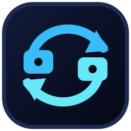

<p align="center">
  
</p>

<h1 align="center">Codex Sync Desktop</h1>

<p align="center">
  使用用户自己的 GitHub 私有仓库，在 Windows 与 macOS 设备之间同步、合并并恢复 Codex 文字会话。
</p>

<p align="center">
  <a href="./LICENSE"></a>
  
  
  
</p>

<p align="center">
  简体中文 · <a href="./README_EN.md">English</a>
</p>

Codex Sync Desktop 面向在多台电脑上使用 Codex 的个人用户。它把活动会话转换成去除图片和附件二进制的文字副本，保存到用户控制的 GitHub 私有仓库，并在目标设备上按内容与时间合并差异、修复 SQLite 和侧栏索引，使历史任务重新出现在 Codex 中。

> [!IMPORTANT]
> 本项目源码公开，但用于同步个人会话的 GitHub 仓库必须保持私有。会话文字中的 Token、密钥、密码、连接串、命令、工具输出和推理内容会被保留。请勿向本项目仓库、Issue、讨论区或公开同步仓库提交真实会话数据和凭据。

> [!NOTE]
> 本项目是社区开源工具，并非 OpenAI 官方产品，也不代表 OpenAI 提供的数据迁移或备份承诺。

## 为什么需要它

Codex 会话主要保存在本机。直接复制整个 `.codex` 目录会混入认证文件、缓存、数据库状态和附件，并容易覆盖目标设备已有任务；只保存 Markdown 摘要又无法恢复完整消息、工具记录和侧栏任务。

本项目提供一条可检查、可合并、可撤销的同步路径：

- 每台设备使用独立目录，不互相覆盖；
- 会话是否相同由实际内容判断，不只看名称或 Task ID；
- 导入前校验路径和 SHA-256；
- 内容分叉时按语义记录和时间后台合并；
- 写入数据库前创建事务撤销点；
- 导入后修复任务标题、SQLite 和 `session_index.jsonl`。

## 核心特性

- **多设备同步**：Windows、Intel macOS 和 Apple Silicon macOS 共用 GitHub 私有仓库；
- **小白首次配置**：检测并准备 Git、GitHub CLI，调用默认浏览器完成 GitHub 授权；
- **连接已有仓库**：列出账号可访问的私有仓库，不要求每台电脑重新创建；
- **ZIP 快照自愈**：误选 GitHub ZIP 解压目录时保留原文件，并在旁边创建正式 Git 克隆；
- **完整文字保留**：保留用户/助手消息、推理、命令、工具调用、工具输出和任务状态；
- **媒体最小化**：不上传图片、附件二进制、Data URL 和独立认证文件；
- **跨平台校验**：SHA-256 校验兼容 Git 在 Windows/macOS 间的换行转换；
- **内容级合并**：同一任务在不同设备继续后，按记录内容和时间合并；
- **标题同步**：读取有效人工标题，拒绝把系统指令或环境上下文当成标题；
- **完整预览**：按动作查看全部会话内容、来源/本机/合并版本，并可修改最终标题；
- **可撤销导入**：默认保留最近一次完整撤销点，并提供清理入口；
- **资源受控**：日志约 2 MiB，预览按选择流式加载，不上传整个 `.codex`。

## 快速开始

普通用户从 [Releases](https://github.com/cieyyy/codex-sync-desktop/releases) 下载对应安装包。Windows 提供安装版和 Portable ZIP；macOS 构建会分别标明 Intel 与 Apple Silicon。

第一次使用前可查看 [新用户首次使用准备清单](./docs/CUSTOMER_PREPARATION.md)。

首次使用：

1. 打开“首次配置向导”。
2. 测试 GitHub 网络；需要代理时填写本机标准 HTTP 代理地址。
3. 自动安装或修复 Git、GitHub CLI。
4. 使用系统默认浏览器登录 GitHub；密码和二次验证只在 GitHub 官方页面输入。
5. 选择“创建新的私有仓库”或“连接已有私有仓库”。
6. 新设备拉取仓库后，在“同步与导入”选择来源设备。
7. 退出 ChatGPT/Codex/Codex++，点击“一键同步”完成导入和索引修复。

不需要下载 GitHub ZIP、U 盘、网盘或手工复制 `.codex`。

## 什么时候需要退出 Codex

以下操作会写入会话、SQLite 或侧栏索引，必须完全退出 ChatGPT/Codex/Codex++：

- 导入并修复；
- 包含其他设备导入的一键同步；
- 撤销最近一次导入。

拉取仓库、导出并推送、预览导入、登录 GitHub 和刷新检查不需要退出；导出前应等待当前回复结束，避免读取尚未写完的最后一条记录。

## 同步数据流

```text
本机 ~/.codex/sessions
  -> 选择活动会话
  -> 移除媒体与附件二进制
  -> 生成标题和 SHA-256 manifest
  -> GitHub 私有仓库/sessions-text/devices/<设备>/
  -> 目标设备拉取并校验
  -> 复制缺失记录或按内容/时间合并
  -> 修复 SQLite + session_index.jsonl
  -> Codex 侧栏重新显示任务
```

详细设计见 [架构说明](./docs/ARCHITECTURE.md) 和 [总体方案](./docs/PRODUCT_SOLUTION_ZH.md)。

## 源码运行

要求 Python 3.9+、Tk 8.6+，推荐 Python 3.11。

```powershell
python -m codex_sync_desktop
```

只读诊断：

```powershell
python -m codex_sync_desktop --diagnose
```

运行测试：

```powershell
python -m unittest discover -s tests -v
```

源码运行依赖很少。普通使用者无需安装 Python，应直接使用 Release 安装包。

## 安全边界

- 自动配置的同步仓库必须通过 GitHub 私有性验证；
- `auth.json`、原始状态数据库、图片和附件目录不会由导出器上传；
- 会话正文中的敏感文字不会自动脱敏；
- manifest 路径不能是绝对路径，也不能包含 `..`；
- 文件校验失败时拒绝导入；
- 数据库修改前创建撤销点；
- 软件不会代替用户输入 GitHub 密码或二次验证码；
- 安装包目前没有商业代码签名或 Apple 公证，下载后应核对 Release SHA-256。

安全问题请不要创建公开 Issue，按照 [SECURITY.md](./SECURITY.md) 私下报告。

## 项目状态与路线

当前版本为 `v0.7.2 Beta 11`，重点是跨设备路径重定位、新旧侧栏索引同步修复、模型供应商兼容，以及首次配置中稳定显示勾选状态的复选框和就绪校验。

- `v0.7.x`：首次配置、内容合并、标题/索引修复、事务撤销；
- 后续：跨设备永久排除规则、仓库容量诊断、更多真实设备端到端验证；
- 稳定版前：Windows 商业签名、Apple Developer 签名与公证。

## 非目标

- 不是实时云盘，其他设备不会被远程同时触发；
- 不同步 GitHub 账号密码、Codex 登录凭据或完整 `.codex`；
- 不保证公开仓库中的会话安全；
- 不替代 GitHub、Codex 或操作系统自身的数据安全机制；
- 不自动重写 Git 历史或永久清除历史提交中的敏感内容。

## 参与项目

提交代码前请阅读 [CONTRIBUTING.md](./CONTRIBUTING.md) 和 [CODE_OF_CONDUCT.md](./CODE_OF_CONDUCT.md)。功能建议和可公开复现的问题可使用 GitHub Issues；请使用虚构或脱敏数据构造复现样例。

## License

本项目基于 [MIT License](./LICENSE) 开源。
